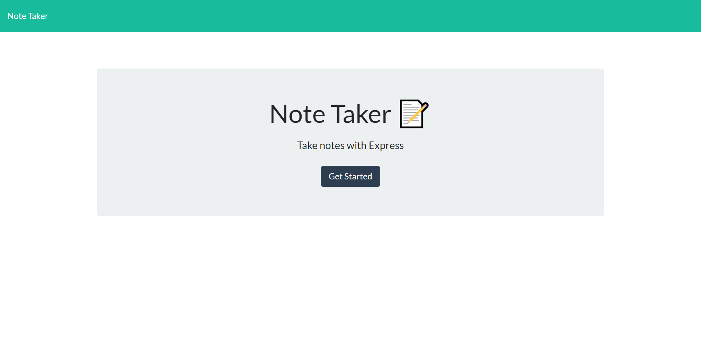
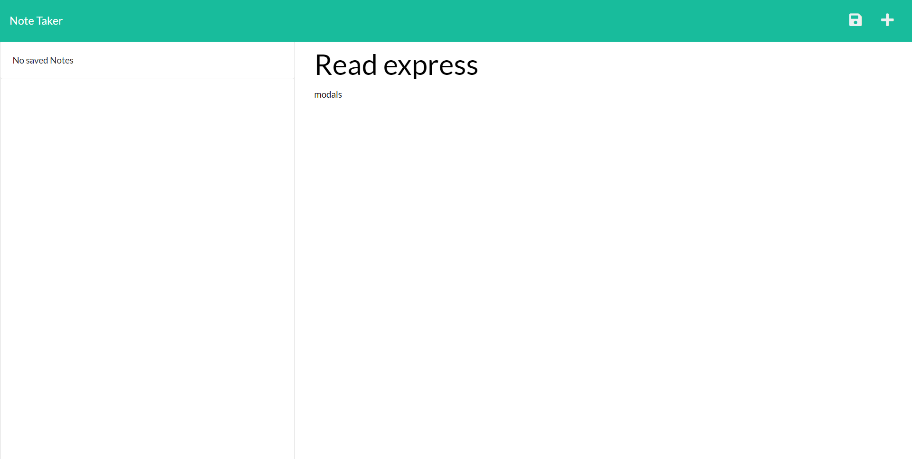
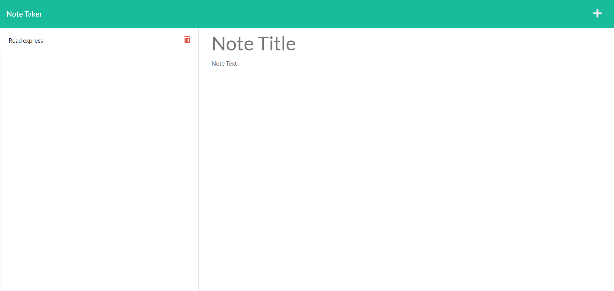
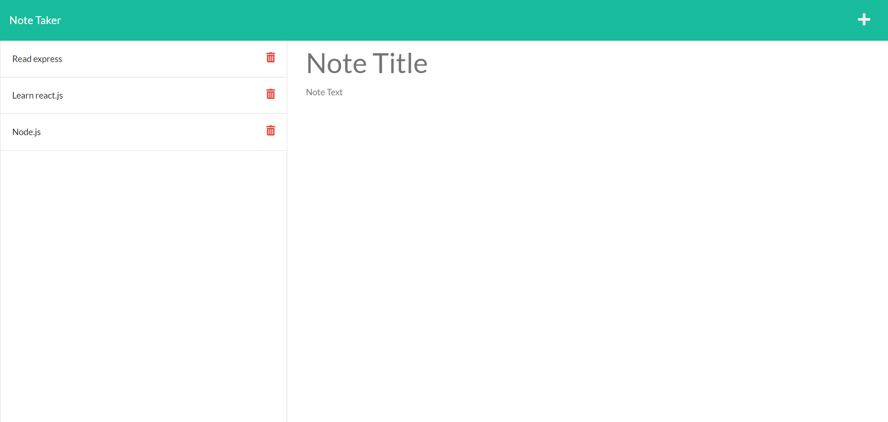
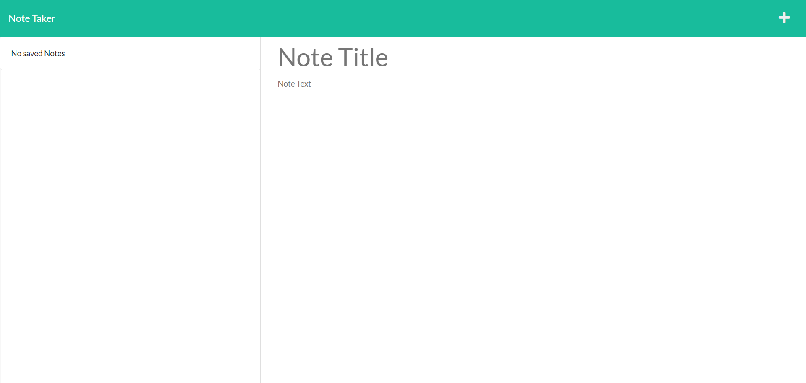

# Note Taker express.js.
  ----
  [](https://opensource.org/licenses/MIT)
## Table of Contents
- [Description](#description)
- [Installation](#installation)
- [Technologies](#Technologies)
- [Usage](#usage)
- [Contribution](#contribution)
- [Test Instructions](#test-instructions)
- [Questions](#questions)

## Description:
This is back end and front end project that help users to create their on notes and add them in a web page that will help them to save the data, and it was made by using node and express.js and have all functionality and getting the data from the back end to the front end. 


## Technologies
```
- HTML.
- JAVASCRIPT.
- BOOTSTRAP.
- NODE.JS.
- EXPRESS.JS.
```


### Installation
```
npm install
```

### Usage
 Click on the Get Started button on the home page to start adding notes. When you get to the notes page, on the left, you see saved notes along with a delete icon to trash the note when you're done. On the right, you can create a new note with a title and notes within the description.


### Contribution
```
Contributions, issues, and feature requests are welcome!
Give a ⭐️ if you like this project!
```

### A Screenshot of my deployed Note Taker

 
 
 
 
 


[full demo video](gdfg)

### Questions? 
For any questions, please contact me with the information below:

doctorqa@yahoo.com

[LinkedIn Profile](https://www.linkedin.com/in/qabas-al-ani-7b858863/)

[Github Profile](https://github.com/Qabas-al-ani)
